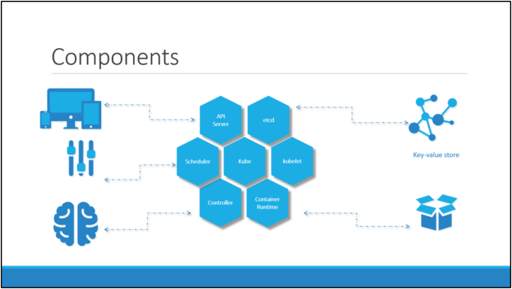

# Kubernetes-Tutorial [Link Udemy](https://www.udemy.com/course/learn-kubernetes/) [Documentation](https://kubernetes.io/docs/home/)
 Kubernetes for the Absolute Beginners - Hands-on
## Kubernetes Overview
```cmd
It is a container orchestration technology used to orchestrate the deployment and management of hundreds
and thousands of containers in a clustered environment.
```


### API server
* The API server acts as the front-end for kubernetes. The users, management devices,
Command line interfaces all talk to the API server to interact with the kubernetes
cluster.
### ETCD
* ETCD is a distributed reliable key-value store used by kubernetes to store all data used to manage the cluster.
* Think of it this way, when you have multiple nodes and multiple masters in your cluster, etcd stores all that information on all the nodes in the cluster in a distributed manner.
* ETCD is responsible for implementing locks within the cluster to ensure there are no conflicts between the Masters.
### Scheduler 
* The scheduler is responsible for distributing work or containers across multiple nodes.
* It looks for newly created containers and assigns them to Nodes.
### Controller
* The controllers are the brain behind orchestration.
*They are responsible for noticing and responding when nodes, containers or endpoints goes down.
* The controllers makes decisions to bring up new containers in such cases.
### Container runtime 
* The container runtime is the underlying software that is used to run containers. 
* In our case it happens to be Docker
### Kubelet
* Kubelet is the agent that runs on each node in the cluster.
* The agent is responsible for making sure that the containers are running on the nodes as expected.

Cluster => Node => POD => container

## Kubernetes Concepts - PODs, ReplicaSets, Deployments
### Yaml In Kubernetes
```bash
four key in yaml:
      * apiVersion:
      * kind:
      * metadata:
      * spec:
```
### PODs with YAML
``` bash
 kubectl cretae -f pod <name file Yaml>: Kubernetes create POD
 
 kubectl get pods: get all pod available in kubernetes
 
 kubectl describe pod <name pod>: show describe of pod have <name>
```
#### Simple Example yaml create pod of container database postgres
```yaml
apiVersion: v1
kind: Pod
metadata:
  name: postgres
  labels:
    tier: db-tier
spec:
  containers:
    - name: postgres
      image: postgres
      env: 
         - name: POSTGRES_PASSWORD
           value: mysecretpassword
```
## Kubernetes basic commands
```bash
kubectl get nodes: get all nodes of the cluster

kubectl version: get version of kubernetes

kubectl get nodes -o wide: show operating system

kubectl get pods -o wide: show Node of pods

kubectl get pods: get all pod of namespace

kubectl run <Name> --image=<image>: create new pod with <Name> image

kubectl describe TYPE NAME_PREFIX: show a detailed description of the selected resources

kubectl delete TYPE NAME_PREFIX: delete of the selected resources

kubectl run <Name> --image=<image> --dry-run=client -o yaml > <name file yaml>.yaml : create a mainfest file

kubectl create -f <name>.yaml : create a resource from the mainfest file
```

#### Simple Example yaml create Replication Controllers and ReplicaSets of container nginx
```yaml
apiVersion: v1
kind: ReplicationController
metadata:
  name: myapp
  labels:
    app: myapp
    type: front-end
spec:
  template:
     metadata:
       name: myapp-pod
       labels:
          app: myapp
          type: front-end
       spec:
           containers: 
             - name: nginx-container
               image: nginx
  replicas: 3
  selector:
    matchLabels:
      type: front-end
```

#### Replication Controller and ReplicaSets
```bash
kubectl create -f <file relicaSet yaml>: create replicaSet by file yaml

kubectl get replicaset: get all replicaset sets createed

kubectl delete replicaset <name replicaset>: delete replicaset

kubectl replace -f <file replicaSets>

kubectl scale --replicas=<number> -f <file replicaSets>

kubectl scale --replicas=6 replicaset <name replicaset>
```


## Kubernetes command 

```bash
kubectl controls the Kubernetes cluster manager.

 Find more information at: https://kubernetes.io/docs/reference/kubectl/overview/

Basic Commands (Beginner):
  create        Create a resource from a file or from stdin
  expose        Take a replication controller, service, deployment or pod and expose it as a new Kubernetes service
  run           Run a particular image on the cluster
  set           Set specific features on objects

Basic Commands (Intermediate):
  explain       Get documentation for a resource
  get           Display one or many resources
  edit          Edit a resource on the server
  delete        Delete resources by file names, stdin, resources and names, or by resources and label selector

Deploy Commands:
  rollout       Manage the rollout of a resource
  scale         Set a new size for a deployment, replica set, or replication controller
  autoscale     Auto-scale a deployment, replica set, stateful set, or replication controller

Cluster Management Commands:
  certificate   Modify certificate resources.
  cluster-info  Display cluster information
  top           Display resource (CPU/memory) usage
  cordon        Mark node as unschedulable
  uncordon      Mark node as schedulable
  drain         Drain node in preparation for maintenance
  taint         Update the taints on one or more nodes

Troubleshooting and Debugging Commands:
  describe      Show details of a specific resource or group of resources
  logs          Print the logs for a container in a pod
  attach        Attach to a running container
  exec          Execute a command in a container
  port-forward  Forward one or more local ports to a pod
  proxy         Run a proxy to the Kubernetes API server
  cp            Copy files and directories to and from containers
  auth          Inspect authorization
  debug         Create debugging sessions for troubleshooting workloads and nodes

Advanced Commands:
  diff          Diff the live version against a would-be applied version
  apply         Apply a configuration to a resource by file name or stdin
  patch         Update fields of a resource
  replace       Replace a resource by file name or stdin
  wait          Experimental: Wait for a specific condition on one or many resources
  kustomize     Build a kustomization target from a directory or URL.

Settings Commands:
  label         Update the labels on a resource
  annotate      Update the annotations on a resource
  completion    Output shell completion code for the specified shell (bash, zsh or fish)

Other Commands:
  alpha         Commands for features in alpha
  api-resources Print the supported API resources on the server
  api-versions  Print the supported API versions on the server, in the form of "group/version"
  config        Modify kubeconfig files
  plugin        Provides utilities for interacting with plugins
  version       Print the client and server version information

Usage:
  kubectl [flags] [options]

Use "kubectl <command> --help" for more information about a given command.
Use "kubectl options" for a list of global command-line options (applies to all commands).
```


